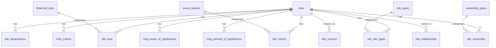

# Historic Sites Database

Comprehensive database of historic sites in the United States — federal (NHLs, NRHP), state (SHPOs), local (county/city landmarks), tribal (THPOs), and private/NGO (National Trust, Battlefield Trust, etc.).

## Current Status

**Phase: Build** — Federal National Historic Landmarks (~2,600 sites)

## Quick Start

### Prerequisites
- Python 3.11+
- [Claude Code CLI](https://docs.anthropic.com/en/docs/claude-code) (for AI enrichment and PDF extraction)
- [Tesseract OCR](https://github.com/tesseract-ocr/tesseract) (for scanned PDF fallback)

### Installation

```bash
git clone https://github.com/barnst1865/Historic_Sites.git
cd Historic_Sites
pip install -e ".[dev]"
```

### Environment Setup

```bash
cp .env.example .env
# Edit .env with your API keys:
#   NPS_API_KEY     — free from https://www.nps.gov/developer/
# AI enrichment uses the Claude Code CLI (no separate API key needed)
```

### Run the Pipeline

```bash
# Full pipeline (all stages)
python scripts/run_pipeline.py

# Individual stages
python scripts/run_ingest.py --source nhl        # Ingest NHL data
python scripts/run_ingest.py --source nrhp       # Ingest full NRHP
python scripts/run_ingest.py --source nominations # Extract nomination PDFs
python scripts/run_enrich.py                      # AI enrichment
python scripts/run_export.py                      # Generate all outputs
```

## Data Sources

| Source | Records | Status | Format |
|--------|---------|--------|--------|
| NRHP ArcGIS REST API | ~1,115 NHLs | Active | JSON/GeoJSON |
| NHL Spreadsheet (NPS) | ~2,600 NHLs | Active | Excel |
| Full NRHP Spreadsheet | ~95,000 | Planned (Phase 9) | Excel |
| NPS Parks API | ~400 NPS sites | Active | JSON |
| NHL Nomination Documents | ~2,600 PDFs | Active | PDF |
| State SHPOs | Varies by state | Planned (Phase 10) | Various |
| National Trust Open Data | Limited | Planned (Phase 11) | ArcGIS |
| Local/County Registries | Varies | Future | Various |
| Tribal (THPOs) | Restricted | Future | Direct engagement |

## Pipeline Stages

1. **Ingest** — Fetch data from ArcGIS, NPS spreadsheets, Parks API, nomination PDFs
2. **Validate** — Coordinate validation, date normalization, entity resolution
3. **Nominations** — Multi-strategy PDF extraction (Claude → OCR → manual flag)
4. **Merge** — Cross-source dedup with idempotent upsert, preserves manual edits
5. **Geocode** — Census Bureau batch + Nominatim fallback for missing coordinates
6. **Profile** — Completeness analysis, outlier detection, data richness routing
7. **Enrich** — Map NRHP taxonomy to our categories, AI fills gaps via Claude
8. **Score** — 8-factor confidence scoring, review queue generation
9. **Export** — KML/KMZ, GeoJSON, interactive HTML map, GeoPackage, review CSV

## Output Formats

| Format | Use Case | Location |
|--------|----------|----------|
| KML/KMZ | Google Maps / Google Earth | `output/kml/` |
| GeoJSON | Web mapping (Leaflet, Mapbox) | `output/geojson/` |
| HTML Map | Interactive browser map (Folium) | `output/maps/` |
| GeoPackage | GIS professionals (QGIS/ArcGIS) | `output/historic_sites_export.gpkg` |
| CSV | Review queue for manual review | `output/review/` |
| HTML Report | Data quality dashboard | `output/data_profile_report.html` |

## Database Schema



## Configuration

- `config/settings.py` — Paths, API URLs, thresholds
- `config/categories.py` — Era, event, type, ownership definitions
- `config/nrhp_taxonomy.py` — Official NRHP Areas of Significance + Criteria A-D

## Manual Review

```bash
# Launch CLI review tool
python scripts/review_tool.py

# Export flagged sites to CSV
python scripts/run_export.py --format csv --review-only
```

## Development

```bash
# Run tests
pytest tests/

# Lint and format
ruff check src/ scripts/ tests/
ruff format src/ scripts/ tests/
```

### Adding a New Data Source

See [ARCHITECTURE.md](ARCHITECTURE.md#adding-a-new-data-source) for the step-by-step guide.

## Roadmap

- **Current**: Phase 0-8 — Federal NHLs + core infrastructure
- **Next**: Phase 9 — Expand to full NRHP (~95K records)
- **Planned**: Phase 10 — State-level sources (SHPOs, DOT markers)
- **Planned**: Phase 11 — NGO sources (National Trust, Battlefield Trust)
- **Future**: Phase 12 — Local/county registries, tribal THPO engagement

## License

MIT — see [LICENSE](LICENSE)
